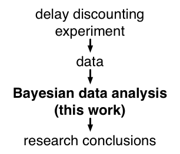

# Hierarchical Bayesian estimation and hypothesis testing for delay discounting tasks


This repository contains the code for the paper:

**Vincent, B., T. (in press) [Hierarchical Bayesian estimation and hypothesis testing for delay discounting tasks](http://link.springer.com/article/10.3758%2Fs13428-015-0672-2), Behavior Research Methods. doi:10.3758/s13428-015-0672-2**

# What does this do?

This code conducts Bayesian estimation and hypothesis testing on data obtained from delay discounting (aka inter-temporal choice) experiments.



# [Documentation](https://github.com/drbenvincent/delay-discounting-analysis/wiki) and help.
Go to the [wiki](https://github.com/drbenvincent/delay-discounting-analysis/wiki) for full instructions.


# Key features:

* Know how confident you are in delay discounting parameters from the posterior distributions calculated.
* Easily interpretable results due to using the 1-parameter hyperbolic discount function.
* Improved accuracy of delay discounting parameter estimates using hierarchical Bayesian estimation. Trial-level responses, and participant- and group-level parameters are all modelled.
* A variety of models are provided to:
  * Estimate discount rates, log(k).
  * Estimate the magnitude effect; how discount rate varies as a function of reward magnitude.
* Explicit modelling of participant errors provides more robust parameter estimates of discounting parameters.

# Easy to use!
The commands use to get your analysis up and running are quite quick and easy. Here is a minimum working example of the demo provided:

```matlab
toolboxPath = setToolboxPath('~/git-local/delay-discounting-analysis/ddToolbox')
cd('~/git-local/delay-discounting-analysis/demo')
myData = DataClass('data');
myData.loadDataFiles({'AC-kirby27-DAYS.txt','CS-kirby27-DAYS.txt','NA-kirby27-DAYS.txt','SB-kirby27-DAYS.txt','bv-kirby27.txt','rm-kirby27.txt','vs-kirby27.txt','BL-kirby27.txt','EP-kirby27.txt','JR-kirby27.txt','KA-kirby27.txt','LJ-kirby27.txt','LY-kirby27.txt','SK-kirby27.txt','VD-kirby27.txt'});
saveFolder = 'methodspaper-kirby27';
model = ModelHierarchicalME(toolboxPath, 'JAGS', myData, saveFolder);
model.conductInference();
model.exportParameterEstimates();
model.plot();
```
# Get in touch
Please use the [GitHub Issues](https://github.com/drbenvincent/delay-discounting-analysis/issues) feature to ask question, report a bug, or request a feature. You'll need a GitHub account to do this, which isn't very hard to set up. But you could always email me instead.
