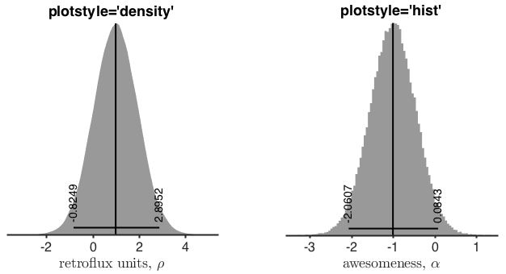
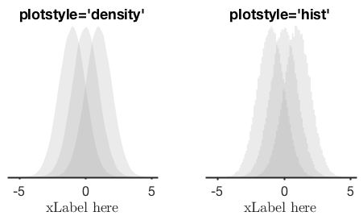
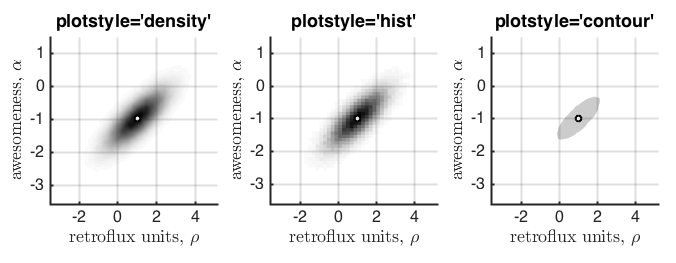
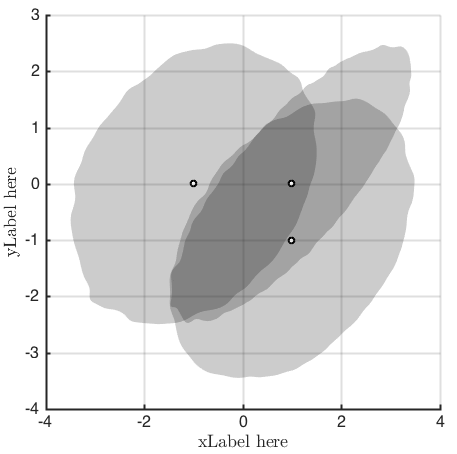
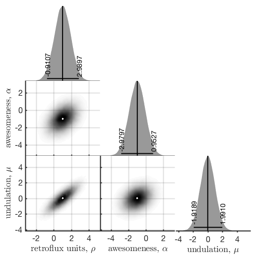
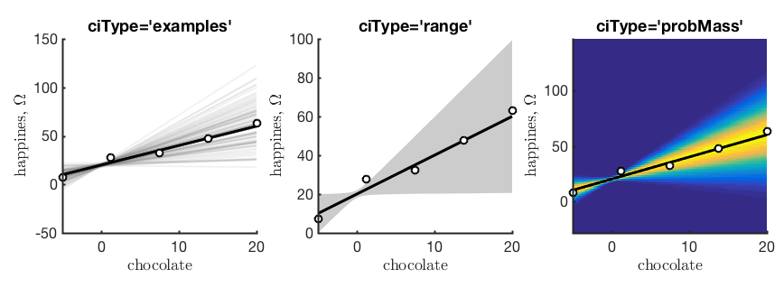

# mcmc-utils-matlab
A set of handy utilities and plotting functions for dealing with MCMC in Matlab. This package is under development. Feel very free to submit Issues for bug reports and feature requests. Also see the Issues for upcoming fixes and new features.


## Installation

In Matlab, navigate to the install location, then type this into the Matlab command window:

    system('git clone --depth=1 git://github.com/drbenvincent/mcmc-utils-matlab.git')

From time to time, this code might get updated. To make sure you have the latest version, then navigate to the directory of the repository in Matlab and type:

    system('git pull')

## Using the package in Matlab

Make sure to set the `pathOfPackage` NOT to the `+mcmc` package itself, but it's parent folder.

````matlab
pathOfPackage = '~/git-local/mcmc-utils-matlab';
addpath(pathOfPackage)
````

One of the first things to do is to call `mcmc.setPlotTheme`, which will change default Matlab plot options to something a bit more stylish. You can just call `mcmc.setPlotTheme()` without any options, to use defaults, or you can supply name-value pairs, such as:


````matlab
mcmc.setPlotTheme('fontsize',16, 'linewidth',2)
````

In practice you will be providing your own MCMC samples, but the code below will generate artificial data. You can also provide a cell array of strings (here `variableNames`) which will be used in the plotting. Note that you can use LaTeX format as well.

````matlab
%% generate faux mcmc data
mu = [1 -1 0];
Sigma = [1 .4 .8;.4 1 .3;.8 .3 1];
samples = mvnrnd(mu, Sigma, 10^5);
%plot(samples(:,1),samples(:,2),'.');
variableNames={'retroflux units, $\rho$',...
	'awesomeness, $\alpha$',...
	'undulation, $\mu$'};
````


## `UnivariateDistribution` class

A `UnivariateDistribution` object provides basic plotting and summary statistics.

````matlab
subplot(1,2,1)
uni = mcmc.UnivariateDistribution(samples(:,1),...
	'xLabel', variableNames{1});
title('plotstyle=''density''')

subplot(1,2,2)
uni2 = mcmc.UnivariateDistribution(samples(:,2),...
	'xLabel', variableNames{2},...
	'plotStyle','hist');
title('plotstyle=''hist''')
````


We can also do group-plots. If the samples we provide is a matrix (more than one column) then each column is treated as a separate distribution to plot.

```matlab
subplot(1,2,1)
uniG1 = mcmc.UnivariateDistribution(samples,...
	'xLabel', 'xLabel here',...
	'plotHDI',false);
title('plotstyle=''density''')

subplot(1,2,2)
uniG2 = mcmc.UnivariateDistribution(samples,...
	'xLabel', 'xLabel here',...
	'plotStyle','hist',...
	'plotHDI',false);
title('plotstyle=''hist''')
```




## `BivariateDistribution` class

A `BivariateDistribution` object also provides some plotting capabilities and calculates mean, median, and mode.

```matlab
subplot(1,3,1)
bi1 = mcmc.BivariateDistribution(samples(:,1),samples(:,2),...
	'xLabel',variableNames{1},...
	'yLabel',variableNames{2});
title('plotstyle=''density''')

subplot(1,3,2)
bi2 = mcmc.BivariateDistribution(samples(:,1),samples(:,2),...
	'xLabel',variableNames{1},...
	'yLabel',variableNames{2},...
	'plotStyle','hist');
title('plotstyle=''hist''')
tempAxisLims = axis;

subplot(1,3,3)
bi3 = mcmc.BivariateDistribution(samples(:,1),samples(:,2),...
	'xLabel',variableNames{1},...
	'yLabel',variableNames{2},...
	'plotStyle','contour',...
	'probMass',0.5);
title('plotstyle=''contour''')
axis(tempAxisLims)
```




You can also do group plots for bivariate distributions. Each column of the samples provided is interpreted and plotted as a separate distribution.

```matlab
figure
% plot all combinations of bivariate
xsamples = [samples(:,1) samples(:,2) samples(:,1)];
ysamples = [samples(:,2) samples(:,3) samples(:,3)];
biG1 = mcmc.BivariateDistribution(xsamples,ysamples,...
	'xLabel','xLabel here',...
	'yLabel','yLabel here',...
	'plotStyle','contour',...
	'probMass',0.95);
```




## `TriPlotSamples` class
We can get a handy plot of all the univariate distributions, and all pairwise joint marginal distributions by using the `TriPlotSamples` class.

```matlab
tri = mcmc.TriPlotSamples(samples,...
	variableNames,...
	'figSize', 15,...
	'pointEstimateType','mode');
```




## `PosteriorPrediction1D` class
If you have a 1D function (e.g. y=mx+c) and the parameters are inferred (by MCMC estimation), then this Matlab object will help in visualising the posterior predictions for your function.

You can specify any 1D function you want, and it should work for functions with any number of parameters.

In many situations, it might be better to automatically generate posterior predictions in you MCMC process. But if you don't want to do that, or can't do that, then this class should be useful.

First, specify a function, ideally in vectorised form.

```matlab
fh = @(x,params) bsxfun(@plus, bsxfun(@times,params(:,1), x), params(:,2));
```

Then generate some data. These will be samples from your MCMC process, but the snippet below just creates artificial data.

```matlab
% generate data
xdata = linspace(-5,20,5);
ydata = fh(xdata,[2 20]) + randn(size(xdata))*5;
variableNames = {'chocolate',...
	'happines, $\Omega$'};

% generate faux samples
nSamples = 10^5;
chocolate = randn([nSamples 1])+20;	% intercept
happines = randn([nSamples 1])+2;	% slope
samples = [happines chocolate]; % samples is of size [nSamples x nParams]

```

Use the `PosteriorPrediction1D` class to make some plots.

```matlab
subplot(1,3,1)
pp1 = mcmc.PosteriorPrediction1D(fh,...
	'xInterp',linspace(-5,20,400),...
	'samples',samples,...
	'xData',xdata,...
	'yData',ydata,...
	'ciType','examples',...
	'variableNames', variableNames);
title('ciType=''examples''')

subplot(1,3,2)
pp2 = mcmc.PosteriorPrediction1D(fh,...
	'xInterp',linspace(-5,20,400),...
	'samples',samples,...
	'xData',xdata,...
	'yData',ydata,...
	'ciType','range',...
	'variableNames', variableNames);
title('ciType=''range''')

subplot(1,3,3)
pp3 = mcmc.PosteriorPrediction1D(fh,...
	'xInterp',linspace(-5,20,400),...
	'samples',samples,...
	'xData',xdata,...
	'yData',ydata,...
	'ciType','probMass',...
	'variableNames', variableNames);
title('ciType=''probMass''')
```


