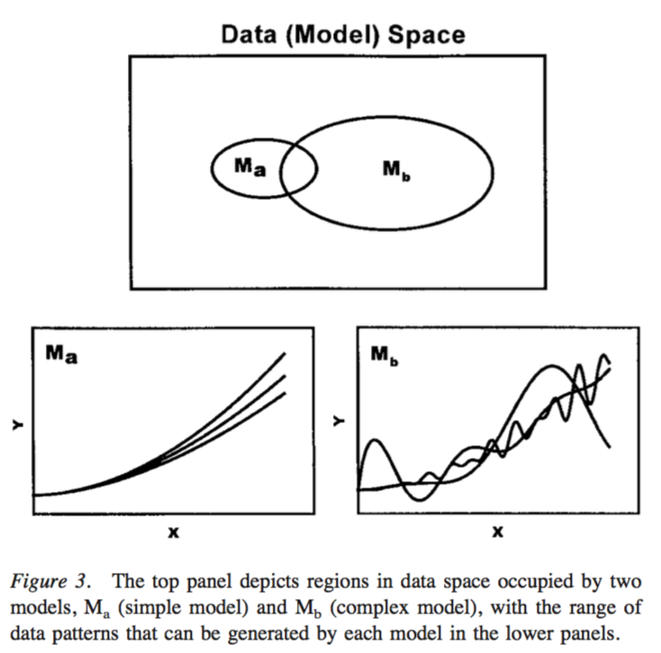
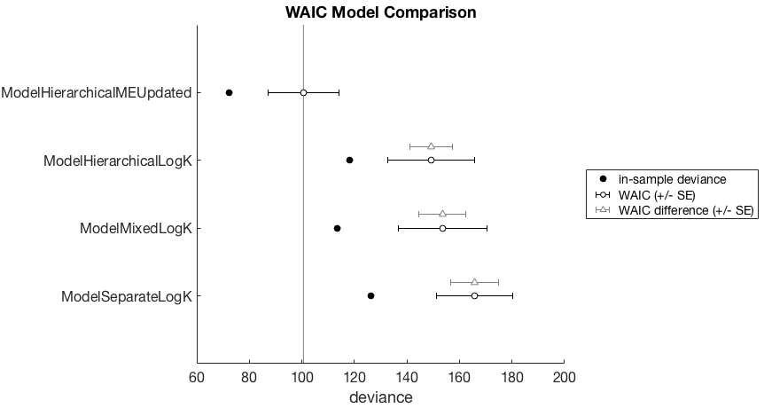
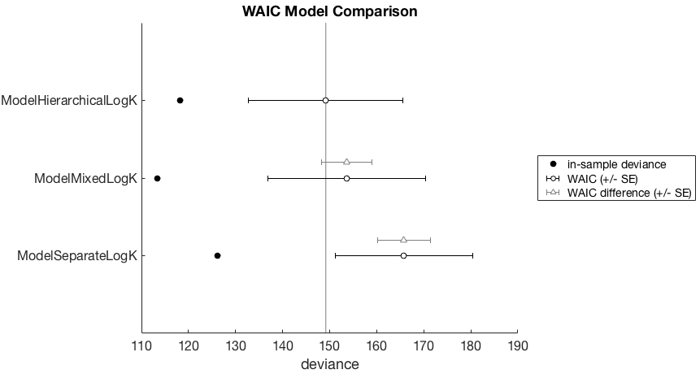

# Counter-intuitive aspects of model complexity

The initial assumption would be that the 'separate' models which treat each participant independently are the simplest, and the 'full hierarchical' models which model participant-level parameters as coming from a group-level distribution, are the most complex. In some ways this is right: we are adding hyperparameters and estimating more things, and the Bayesian Network diagrams look more complex.

However a more accurate view of model complexity would focus not on the number of parameters, or adding more levels in the hierarchy. Instead, we can equate model complexity with the breadth of data space which is consistent with the model (see Figure below, from Pitt _et al_, 2002).




Under this approach, complex models are ones which make a broad range of predictions in data space. Simple models are ones which make more specific predictions in data space. This focus on data space does not include a notion of number of parameters. You can imagine some situations where more model parameters will mean a more complex model in that has a greater ability to fit more data.

However, you can also imagine a situation where adding parameters might actually _decrease_ the model complexity. An example of this, relevant to our particular context, would be the addition of a hyper-parameter, i.e. adding a group-level distribution of discount rates. Despite the addition of another 'level' of inference and more parameters to estimate, what we have done is to actually _decrease_ the range of plausible discount rates at the participant level. We can think of this not as adding parameters, but as adding prior information, which could actually decrease the breadth of plausible observations in data space under the model.

## An example

For this example (see `demo_pooling_WAIC.m`) we will fit the example dataset collected with the Kirby (2009) method. We will conduct parameter estimation for the following models:
- ModelSeparateLogK (simplest in the number of parameters sense)
- ModelMixedLogK
- ModelHierarchicalLogK
- ModelHierarchicalMEUpdated (most complex in the number of parameters sense)

First, some set up
```matlab
toolbox_path = '~/git-local/delay-discounting-analysis/ddToolbox';
addpath(toolbox_path)
datapath = '~/git-local/delay-discounting-analysis/demo/datasets/kirby';
addpath(toolbox_path)
ddAnalysisSetUp();
mcmc_params = struct('nsamples', 10000,...
		'nchains', 4,...
		'nburnin', 2000);
myData = Data(datapath, 'files', allFilesInFolder(datapath, 'txt'));
```

Then we conduct parameter estimation with the models

```matlab
modelA = ModelSeparateLogK(...
	myData,...
	'savePath', fullfile(pwd,'pooling_demo','modelA'),...
	'mcmcParams', mcmc_params);

modelB = ModelMixedLogK(...
	myData,...
	'savePath', fullfile(pwd,'pooling_demo','modelB'),...
	'mcmcParams', mcmc_params);

modelC = ModelHierarchicalLogK(...
	myData,...
	'savePath', fullfile(pwd,'pooling_demo','modelC'),...
	'mcmcParams', mcmc_params);

modelD = ModelHierarchicalMEUpdated(...
	myData,...
	'savePath', fullfile(pwd,'pooling_demo','modelD'),...
	'mcmcParams', mcmc_params);
```

Then we can do some model comparison with WAIC.

```matlab
waic = [modelA.WAIC_stats,...
	modelB.WAIC_stats,...
	modelC.WAIC_stats,...
	modelD.WAIC_stats];

waic_comparison_table = waic.compare()
```


and get a corresponding plot

```matlab
waic.plot()
```

Note that the `pWAIC` column is a measure of model complexity, the 'effective number of parameters'. So interestingly, the apparently more complex model (`ModelHierarchicalMEUpdated`) actually has the lowest quantitatively measured model complexity.



So what is going on here. We might initially think that the `ModelHierarchicalMEUpdated` model is more complex because it has both slope and intercept parameters for the magnitude effect _and_ group level estimates of the mean and variance of both these parameters. This could be because the data shows a strong magnitude effect, and the vanilla hyperbolic models (which don't capture the magnitude effect) are simply less capable of fitting the data. We can see that the in-sample deviance is lowest for this model, so it does seem as if it can account for the observed data better than the other models. However, the model also wins by WAIC, and so we can probably eliminate any concerns about model overfitting here.

Looking at the WAIC values for the hyperbolic models (`*logK`) we actually see that the hierarchical is the next best, followed by the partial pooling model, and the separate model is the worst. This is against our naive predictions of model complexity increasing with the number of parameters.

Let's eliminate the magnitude effect model for the moment to take a closer look.

```matlab
waic = [modelA.WAIC_stats,...
	modelB.WAIC_stats,...
	modelC.WAIC_stats];
waic.plot()
```



Now we have a better look at the WAIC difference (gray triangles), relative to the best model (`ModelHierarchicalLogK`) under consideration. It looks as if the in-sample deviance is lower, but we are less interested in this. In terms of WAIC, the model is worse, but the standard error overlaps with the WAIC of the winning model. However the standard error of the WAIC difference of the `ModelSeparateLogK` model does not overlap with the winning model. So we have some suspicion that this model is genuinely worse.

This is pretty interesting. What we have seen here is that the _apparent_ increase in model complexity by adding (group-level) parameters actually makes the model simpler. The group-level hyperparameters are acting as shrinkage priors, making a _smaller_ region of data space plausible under the model (and priors). And what was most interesting was that adding even more parameters and specifying our knowledge of the magnitude effect made the model even better, as measured by WAIC.

This is not to say that adding more parameters and group-level inferences will _always_ make the models simpler. It depends what the priors and hyperpriors are, but in general we should remember that adding more knowledge actually can _reduce_ model complexity, and make the model better.


## References

Pitt, M. A., Myung, I. J., & Zhang, S. (2002). Toward a method of selecting among computational models of cognition. Psychological Review, 109(3), 472–491. http://doi.org/10.1037//0033-295X.109.3.472
