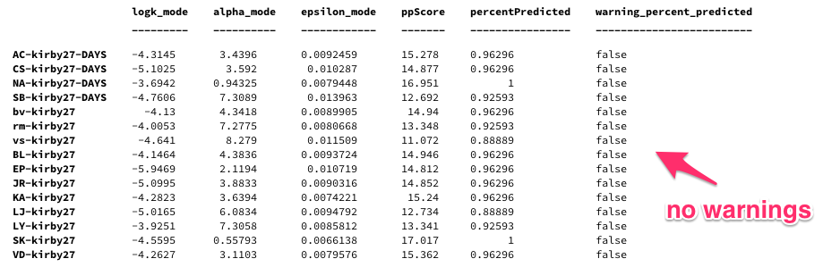
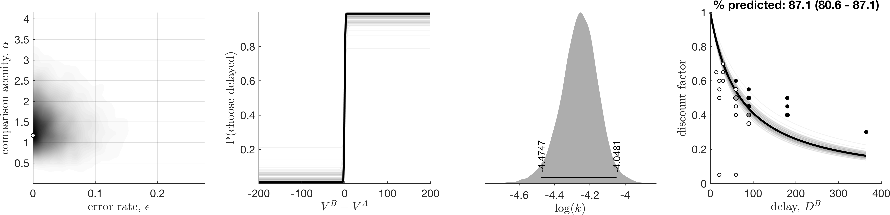
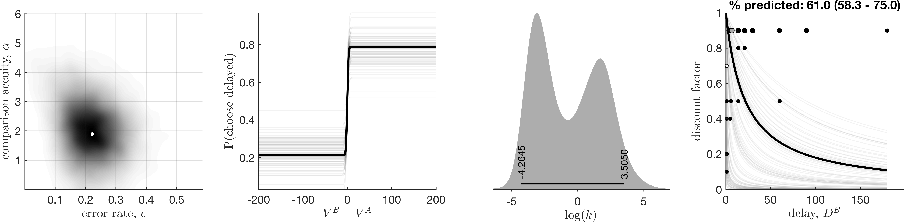

# How to: vet data

The main aim of this analysis toolbox is to make inferences about a participant's discounting behaviour. These inferences are captured by our posterior distributions over model parameters. However, these distributions only have a meaningful interpretation if the model is a reasonable explanation of how a participant is actually responding. Therefore we may need to exclude some data if the model used is a very poor fit to the data.

As of version 1.3, we can quantitatively assess the model goodness of fit, and use this as a basis for excluding participants. Two measures are calculated:

* **Percent responses predicted.** This is the most straight forward to interpret. We report the proportion of responses that the model can accurately predict, and this metric has a distribution (corresponding to number of MCMC samples obtained).
* **Goodness of fit score.** We calculate the log ratio of the probability of the data under the model vs a control model. This also has a distribution as above, and scores. Distributions should be above 0, otherwise the data is equally (or more) consistent with the control model (random response on each trial).

Currently, I am recommending the following exclusion criterion:
> Exclude a datafile (or participant) if the distribution of 'Percent responses predicted' overlaps with 0.5.

This amounts to saying, if we do _not_ believe that the model can predict the responses in an experiment session greater than a control model (random responding), then we have no faith that the parameter estimates carry any meaning, and will therefore exclude this data file.

If you are using a repeated measures experiment design, then you may wish to exclude an entire participant even if the model is no better than chance just for one condition.

This exclusion criterion is usefully indicated in the `.csv` file of parameter estimates that the software exports. Look for the column labelled `warning_percent_predicted`. See the example below:

## Examples

### Good fit

### Bad fit, which was detected as such
This did not have Rhat convergence issues, but our posterior predictive checks highlighted this model is not better than a random model.

### Bad fit, detected by eye
A bad fit, which was not flagged as having poor convergence, nor a poor ability to predict responses. I've found such cases to be relatively rate, but I do recommend manual checking (see below).

## Recommended workflow
If you are using any sort of hierarchical estimation model, then I recommend:

1. Run the analysis on all data.
2. Examine the exported parameter estimates, and check to see if any data files have been flagged as `warning_percent_predicted` equal to 1 (i.e. true).
3. Examine the exported figures and make any additional qualitative judgements (see advice below) on exclusion.
4. Re-run the analysis, but having excluded the appropriate data files.

If you are using entirely independent estimation models, then the parameter estimates of one participant are indecent of another. Therefore you can simply discard any data from the parameter estimates, i.e. ignoring step 4 above.
