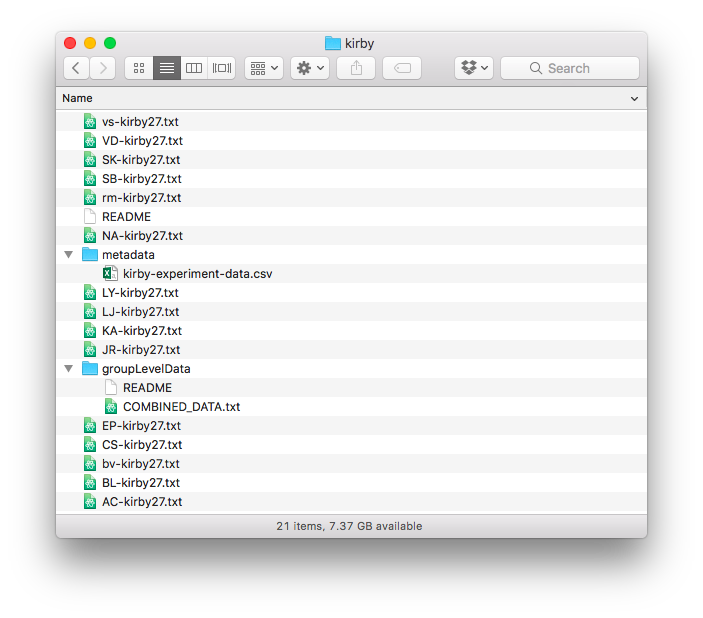

# How to: store raw data

## Location of raw data files
At the moment it is best to keep all your raw discounting data files in one folder. If you have a repeated measures situation where you might have the same participant who underwent multiple conditions, it's best to organise that using an appropriate file naming convention, rather than by separating data files into subfolders. The location of your data folder is not so important, but you must know the path name for when you come to load in your raw data.

## Format of each raw data file
We assume that we have one data file for every experiment run. So even if we have a repeated measures situation where the same participant runs through a discounting experiment under multiple conditions, we assume that each of these are stored in separate files. The file naming convention you use should make it clear which participant and condition etc that the data corresponds to.

Each data file should be a tab-delimited `.txt` file containing the trial data for an individual participant. The format of these participant data files needs to contain 5 columns, with headers `A`, `DA`, `B`, `DB`, `R`. Each row corresponds to one experimental trial.

    A	DA	B	DB	R
    80	0	85	157	0
    34	0	50	30	1
    25	0	60	14	1
    11	0	30	7	1
    49	0	60	89	0
    etc

Optionally, we can add columns for the probability of obtaining the reward, such as

    A	DA	PA      B	DB	PB    R
    80	0	1       85	157	1     0
    34	0	1       50	30	1     1
    25	0	1       60	14	1     1
    11	0	1       30	7	1     1
    49	0	1       60	89	1     0
    etc

Column names mean:
- `A` reward of option A
- `DA` delay of option A, in days
- `PA` probability of achieving the reward
- `B` reward of option B
- `DB` delay of option B, in days
- `PB` probability of achieving the reward
- `R` is the participant response.

Note that the the coding of responses are:
* participant chooses delayed reward, ie option B, then `R = 1`
* participant chooses sooner reward, ie option A, then `R = 0`

The ordering of the columns should not matter, as the data is extracted using the column header name (i.e. first row of the file).
