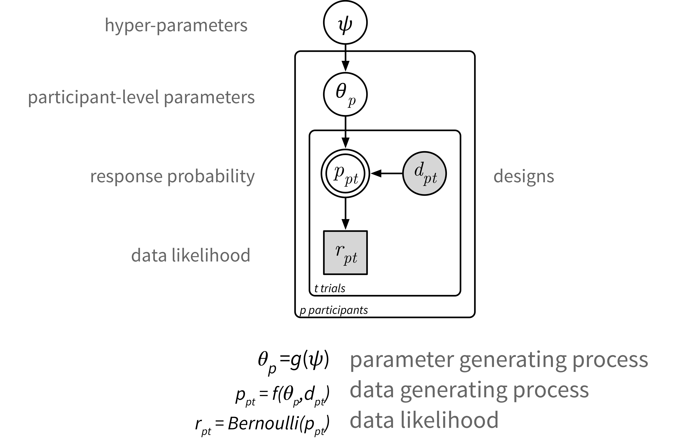

# Discount functions available

A number of discounting models are available, all with the following basic form. The models differ in either a) presence/absence of hyperpriors, b) the discount functions in the data generating process which specifies the response probability.

The 'data generating process' describes the response probability. This consists of the psychometric link function which captures response errors, and the discount function which computes the present subjective value of prospects. See the paper for details.

|  Discount function    | Equation | Model suffix | Main parameters |
| :---         |     :---:             |         :---:  |  :---:  |
| Exponential  |  `exp(-k*D)`  | `*Exp1`  | `k` |
| Hyperbolic  |  `1/(1+k*D)`  | `*LogK`  | `logk` |
| Hyperbolic (with magnitude effect)  |  `1/(1+[exp(m*log(R)+c)]*D)`  | `*ME`  | `m, c` |
| Hyperboloid  |  `1/[(1+k*D)^S]`  | `*Hyperboloid`  | `logk, S` |
| Beta Delta  |  `beta*delta^D`  | `*BetaDelta`  | `beta, delta` |

In the equations, `D` = delay, and `R` = reward.

# Detailed information on discount functions

Note that `Separate`, `Mixed` and `Hierarchical` refers to the level of parameter pooling (hierarchical inference). See the page [Decide on level of parameter pooling](http://drbenvincent.github.io/delay-discounting-analysis/discussion/level_of_pooling.html) for more information on this.

## Exponential discounting

|  Model name    | Fixed Effects | Random Effects (by-participant) | Hyper-priors (thus shrinkage to group mean) |
| :---         |     :---:             |         :---:  |  :---:  |
| `ModelSeparateExp1`  |  -  | `k`, `alpha`, `epsilon`  | - |
| `ModelMixedExp1`   |  -  | `k`, `alpha`, `epsilon`  | `alpha`, `epsilon` |
| `ModelHierarchicalExp1`  |  -  | `k`, `alpha`, `epsilon`  | `k`, `alpha`, `epsilon` |

## Hyperbolic discounting

|  Model name    | Fixed Effects | Random Effects (by-participant) | Hyper-priors (thus shrinkage to group mean) |
| :---         |     :---:             |         :---:  |  :---:  |
| `ModelSeparateLogK`  |  -  | `logk`, `alpha`, `epsilon`  | - |
| `ModelMixedLogK`   |  -  | `logk`, `alpha`, `epsilon`  | `alpha`, `epsilon` |
| `ModelHierarchicalLogK`  |  -  | `logk`, `alpha`, `epsilon`  | `logk`, `alpha`, `epsilon` |

## Hyperbolic discounting, with magnitude effect

|  Model name    | Fixed Effects | Random Effects (by-participant) | Hyper-priors (thus shrinkage to group mean) |
| :---         |     :---:             |         :---:  |  :---:  |
| `ModelSeparateME `  |  -  | `m`, `c`, `alpha`, `epsilon`  | - |
| `ModelMixedME`  |  -  | `m`, `c`, `alpha`, `epsilon`  | `alpha`, `epsilon` |
| `ModelHierarchicalME`  |  -  | `m`, `c`, `alpha`, `epsilon`  | `m`, `c`, `alpha`, `epsilon` (model focussed upon in the paper) |

### Prior over slope of the magnitude effect
The prior over `m` was well thought out and is described in depth in the Appendix of the paper. So there should be little need to change this, aside from perhaps if you were investigating a specific sub-population of people who deviated from the general population in some way. Of course, as we get more information about the magnitude effect, the prior over `m` could be updated to reflect this increased knowledge.

### Prior over the intercept of the magnitude effect
The prior over `c` was kept very uninformative, on the basis that it reflects a scaling up or down of discount rates. This can vary a lot between participants, and of course the intercept will change depending upon the unit of reward, is it £, €, or $, or even in number of chocolates? Therefore people may well want to provide a bit more of an informative prior over the intercepts which is appropriate for your research context.

## Hyperboloid
Hyperboloid discounting, of the form `1/[(1+kD)^S]`. This is equivalent to exponential discounting of subjective time (according to Webber's Law).

|  Model name    | Fixed Effects | Random Effects (by-participant) | Hyper-priors (thus shrinkage to group mean) |
| :---         |     :---:             |         :---:  |  :---:  |
| `ModelSeparateHyperboloid`  |  -  | `logk`, `S`, `alpha`, `epsilon`  | - |
| `ModelMixedHyperboloid`  |  -  | `logk `, `S`, `alpha`, `epsilon`  | `alpha`, `epsilon` |
| `ModelHierarchicalHyperboloid`  |  -  | `logk `, `S`, `alpha`, `epsilon`  | `logk `, `S`, `alpha`, `epsilon`|

## Beta-Delta
The discount factor is `beta*delta^D`, see (Laibson, 1997).

**I _highly_ recommend updating the priors for this discount function.**

|  Model name    | Fixed Effects | Random Effects (by-participant) | Hyper-priors (thus shrinkage to group mean) |
| :---         |     :---:             |         :---:  |  :---:  |
| `ModelSeparateBetaDelta`  |  -  | `beta`, `delta`, `alpha`, `epsilon`  | - |
| `ModelMixedBetaDelta`  |  -  | `beta `, `delta`, `alpha`, `epsilon`  | `alpha`, `epsilon` |
| `ModelHierarchicalBetaDelta`  |  -  | `beta `, `delta`, `alpha`, `epsilon`  | `beta`, `delta`, `alpha`, `epsilon`|
