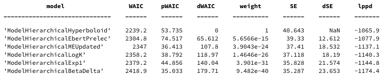
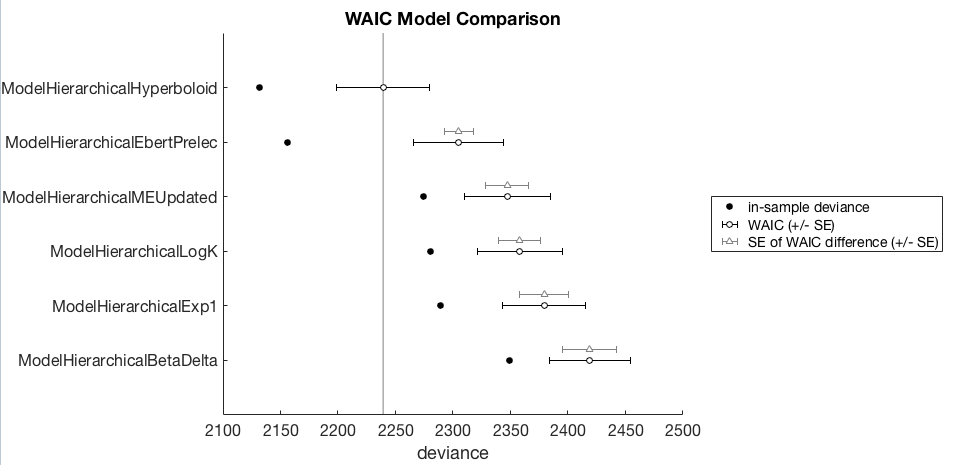

# Tutorial: model comparison with WAIC

Model comparison is tricky, so care needs to be taken here.

Below we describe an example where you might be interested in working out which discount function is the best model for a given dataset.  That is, to evaluate how well a number discount functions can account for all data in a dataset - which is different from asking which is the best discount function for each individual participant in a dataset.

Note that the WAIC model comparison functionality was implemented with reference to both Gelman et al (2013) and McElreath (2016).

The code is available in `demo_WAIC.m`, but let's walk through it. First some setup code

```matlab
toolbox_path = '~/git-local/delay-discounting-analysis/ddToolbox';
addpath(toolbox_path)
datapath = '~/git-local/delay-discounting-analysis/demo/datasets/non_parametric';

addpath(toolbox_path)
ddAnalysisSetUp();
```

Now we'll set up MCMC parameters

```matlab
mcmc_params = struct('nsamples', 10000,...
		'nchains', 4,...
		'nburnin', 2000);
```

Then create a `Data` object that we'll analyse with multiple models.

```matlab
myData = Data(datapath, 'files', allFilesInFolder(datapath, 'txt'));
```

And conduct parameter estimation on multiple models. In a real context you'd perhaps want to use more descriptive names for the the models and output folders, but this will be enough to get the right idea. This will take a little while to compute.

```matlab
modelA = ModelHierarchicalLogK(...
	myData,...
	'savePath', fullfile(pwd,'output','modelA'),...
	'mcmcParams', mcmc_params);

modelB = ModelHierarchicalExp1(...
	myData,...
	'savePath', fullfile(pwd,'output','modelB'),...
	'mcmcParams', mcmc_params);

modelC = ModelHierarchicalHyperboloid(...
	myData,...
	'savePath', fullfile(pwd,'output','modelC'),...
	'mcmcParams', mcmc_params);

modelD = ModelHierarchicalMEUpdated(...
	myData,...
	'savePath', fullfile(pwd,'output','modelD'),...
	'mcmcParams', mcmc_params);

modelE = ModelHierarchicalBetaDelta(...
	myData,...
	'savePath', fullfile(pwd,'output','modelE'),...
	'mcmcParams', mcmc_params);

modelF = ModelHierarchicalEbertPrelec(...
	myData,...
	'savePath', fullfile(pwd,'output','modelF'),...
	'mcmcParams', mcmc_params);

```

At this point, you'd want to do your due diligence to ensure that the parameter estimates are kosher approximations of the true posterior. So, you could look at the Rhat chain convergence diagnostics, visually examine the MCMC chains, and also the model 'fits' and posterior predictive plots. Without this step, you cannot be really sure that the model comparison provides meaningful information.

But assuming we've done that, each model contains a `WAIC` object, which we can access with the `model.WAIC_stats` property. We'll create an array of these WAIC objects from each of the models.

```matlab
waic = [modelA.WAIC_stats,...
	modelB.WAIC_stats,...
	modelC.WAIC_stats,...
	modelD.WAIC_stats,...
	modelE.WAIC_stats,...
	modelF.WAIC_stats];
```

We can now compare the models with:

```matlab
waic_comparison_table = waic.compare()
```



with the following columns. Readers are referred to McElreath (2016) for more details
- **WAIC:** Smaller values are better, lower out of sample deviance.
- **pWAIC:** Estimated effective number of parameters.
- **dWAIC:** Difference between each model's WAIC and the model with lowest WAIC.
- **weight:** is the Akaike weight
- **SE:** is the standard error of the WAIC value over data points (trials)
- **dSE:** standard error of the difference in WAIC values and the top-ranked model.

We can also produce a nice WAIC plot (suitable for dropping into a paper) with

```matlab
waic.plot()
```



I will avoid attempting to provide a thorough description of how to interpret this WAIC comparison, I'll leave this to others who've already done a thorough job. Readers are referred to McElreath (2016) for an explanation of this plot, the style of which is directly copied from that book.

In case you don't have a copy of McElreath's book, here is a video lecture he gave on model comparison to get you started.

<iframe width="560" height="315" src="https://www.youtube.com/embed/vSjL2Zc-gEQ" frameborder="0" allow="autoplay; encrypted-media" allowfullscreen></iframe>

Although briefly, in this example, the winning model is the hierarchical hyperboloid model as it has the lowest WAIC. The models are ordered from best (top) to worst (bottom). The black open circles +/- SE represent the WAIC for other models, but the gray triangles +/- SE represent the difference between a model and the winning model. So as a first pass analysis one could look to see whether these non-winning models are worse than the winning model by seeing how far away these WAIC differences are from the winning model.


## Reference

Gelman, A., Carlin, J. B., Stern, H. S., Dunson, D. B., Vehtari, A., & Rubin, D. B. (2013). Bayesian Data Analysis, Third Edition. CRC Press.

McElreath, R. (2016). Statistical Rethinking: A Bayesian Course with Examples in R and Stan. CRC Press.
